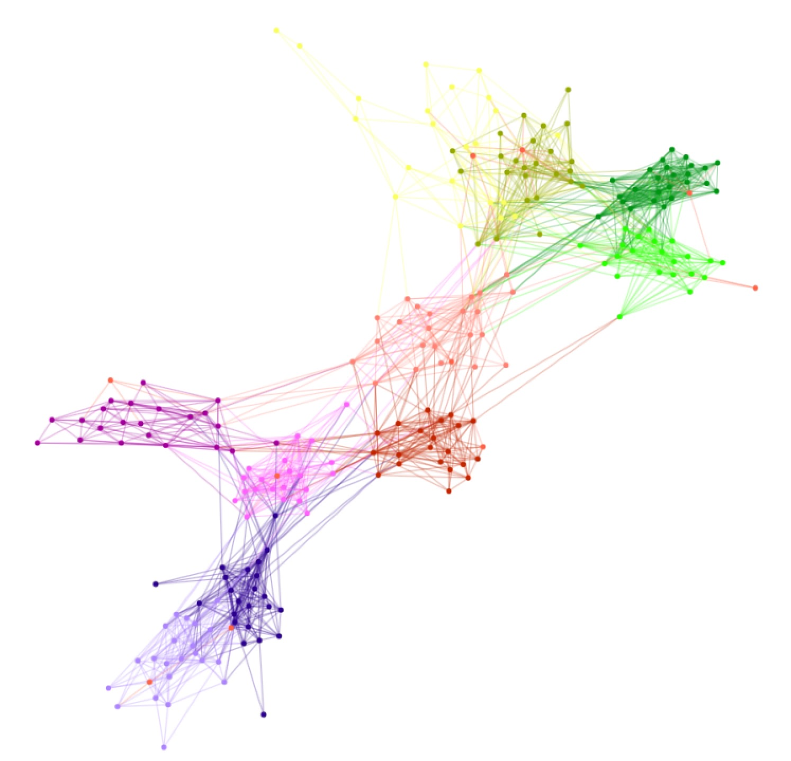

# Network_Science_project
## Network data exploration

### Data Description: Primary School – Cumulative Networks ***[Link: http://www.sociopatterns.org/datasets/primary-school-cumulative-networks/]***

Data collection took place on October 1 and 2, 2009, in a primary school in Lyon, France. The subjects of the study were students aged 6 to 12 years and their teachers. Each teacher was assigned a specific class, with each class consisting of 22 to 26 students, and each class had its own classroom. The network structure of the data consists of 242 nodes (232 students and 10 teachers) and edges weighted by two attributes. Each student has two characteristics: class (e.g., 4A) and gender. Teachers are classified separately (teacher category), but their gender is unknown. An edge represents face-to-face interactions between nodes throughout the day. Each edge has two weighted attributes: the first is Duration, representing the total time A and B spent in face-to-face proximity; the second is Count, representing the number of contacts during the school day.

The data were used in the paper "High-Resolution Measurements of Face-to-Face Contact Patterns in a Primary School" ***[Link: https://journals.plos.org/plosone/article?id=10.1371/journal.pone.0023176].*** The article explores the spread of respiratory infections among children in primary school, evaluates countermeasures, and assesses the impact of infections in school on society as a whole.

The research question of this work can be briefly summarized as follows: "What are the main characteristics of contacts between children in the school environment, and how can these data be used to assess the risk of respiratory infection transmission and develop effective control measures in the event of epidemics and pandemics?"

We are interested in the network structure of the collected data, so we do not focus on disease spread but rather study the interactions between students. We build a graph based on these interactions and study its characteristics.

First, it is worth noting that the edges have two weights, and to calculate the basic parameters of the graph, we need to choose exactly one edge weight. We chose the total number of contacts and used this to consider the graph's edge characteristics in our further actions. In the initial data loading and visualization attempt, it is visually noticeable that the number of edges is quite high, and the graph is difficult to interpret due to overlapping edges and high density. To address these shortcomings and make the graph more visually comprehensible, we transformed the text file using a script and kept only the edges where the weight exceeded 5 (i.e., people A and B met more than five times during the day). As a result, the graph became less dense, which facilitated its visual study and the interpretation of characteristics.

#### Basic Graph Parameters:
- Number of nodes: 242
- Number of edges: 1,650
- Average degree of nodes: 13.983
- Graph diameter: 7
- Average shortest path: 3.31
- Graph density: 0.06
- Connectivity: The graph is connected (the is.connected() function returns TRUE).

#### Vertex Centrality Measures:
We applied the following commands:
- centr_degree(graph) – degree centrality
- centr_clo(graph) – closeness centrality
- centr_betw(graph) – betweenness centrality
- centr_eigen(graph) – eigenvector centrality.

The results were as follows:
- 0.07 – degree centrality
- 0.19 – closeness centrality
- 0.13 – betweenness centrality
- 0.86 – eigenvector centrality.

It is worth noting that 3 out of 4 methods indicate relatively low centrality for the graph, which seems reasonable given the visual representation of the graph (shown at the bottom of the file). It can be assumed that students from different classes have limited interactions, which is reflected in the graph and centrality calculations.

#### Correlation Matrix of Centralities:

               | deg        | clos       | betw       | eig vector |
| deg          | 1.0000000  | 0.6220949  | 0.48933985 | 0.54420803 |
| clos         | 0.6220949  | 1.0000000  | 0.65380688 | 0.11369095 |
| betw         | 0.48933985 | 0.65380688 | 1.00000000 | 0.02665937 |
| eig.vector   | 0.54420803 | 0.11369095 | 0.02665937 | 1.00000000 |

As we can see, most centrality measures are not strongly correlated with each other, meaning that each method should be calculated separately.

#### Assortativity:
We calculated assortativity using the following commands:
- assortativity_degree()
- assortativity_nominal()
- assortativity().

Assortativity by degree: 0.2607793. It shows how likely new nodes are to connect to the most central ones. In our case, the tendency is relatively weak.

Assortativity: 0.5823714. Overall, the assortativity coefficient is quite high, suggesting preferential attachment, which makes sense given that students are divided into classes.

#### Transitivity:
When calculating transitivity using the transitivity(data_igraph type = "local") and transitivity(data_igraph type = "global") commands, 12 clusters were identified (likely 10 classes plus 2 clusters consisting of friends from different classes), and the global transitivity coefficient is 0.4652. Given that the global transitivity coefficient is quite high, we can infer a high degree of clustering in the graph, indicating frequent interactions among students within classes.

#### Random Graph Models:
We chose among the three models: Barabási-Albert, Watts-Strogatz, and Erdős-Rényi, to see which one best describes our data.

For the ***Erdős-Rényi model***, the degree distribution of our graph and the random graph is similar, but the average shortest paths differ significantly, making this model unsuitable for describing our data.

For the ***Watts-Strogatz model***, the number of edges between nodes in the random graph is significantly lower than in the graph based on real data, so this model also poorly describes our data.

For the ***Barabási-Albert model***, the degree distribution densities of the random graph and the graph based on real data differ significantly, so this model does not describe our data well either.

### The graph “Students interaction – Primary School”
